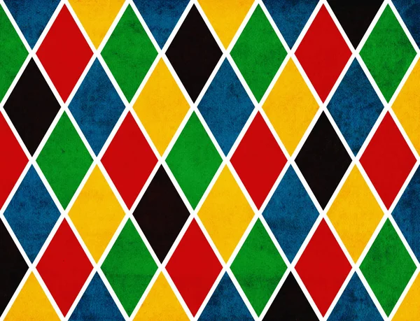

# Trabajo Práctico Nro. 3

## Consigna: 
Teniendo en cuenta que:
- Una homografía se representa con una matriz de 3 × 3.
- Tiene 8 grados de libertad y puede ser recuperada con 4 puntos 

Usando como base el programa anterior, se pide:

- Crear un programa que permita seleccionar 4 puntos de una primera imagen.
- Luego crear un método que compute una homografía entre dichos 4 puntos y una
segunda imagen estándar de m × n pixeles.
- Por último aplicar esta transformación para llevar (rectificar) la porción de la primera
imagen definida por los 4 puntos elegidos a la segunda de m × n.

Ayuda: 

```sh
  cv2.getPerspectiveTransform
  ```
```sh
  cv2.warpPerspective
  ```

Para correr el programa colocar en la consola:
```sh
  python3 tp3.py
  ```

Para salir del programa luego de la selección de los cuatro puntos presionar "Q".

## Desarrollo

Se utilizará como imagen base:



A continuación se observa el resultado de la aplicación de la transformada: 


